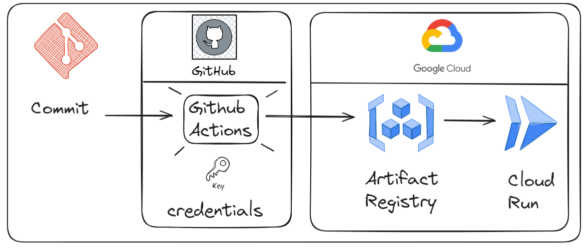

# Deploy to cloud run GCP with github actions

## Tutorial

Video: 

## Steps
1 - login GCP

2 - gcloud configure docker

3 - build docker image

4 - tag docker image with gcr uri

5 - push docker image to container registry

6 - deploy docker image to cloud run

## Developer

[@wlcamargo](https://www.linkedin.com/in/wallace-camargo-35b615171/) 

## References

https://github.com/geandeveloper/helloworld-geandeveloper/tree/main

https://www.youtube.com/watch?v=QXs78sFNIHY

